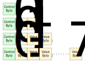

# ILInt Specification

* Chino, F. J. T.
* Teixeira, A. R. D.

## Introduction

The **ILInt** is a format that can be used to encode an unsigned 64-bit integer in the
most compact way possible. Instead of storing the 64-bit value in 8 bytes, it will
encode it using 1 to 9 bytes with the smaller values using less bytes to be encoded
than larger values.

## Format

The **ILInt** is composed by 1 **control byte** followed by 0 to 8 **value bytes**:

 

The **control byte** defines how the value is encoded. If its value is between 0 and 247,
it will represent the encoded value itself and no **value bytes** is present. If the
value of the **control byte** is larger than 247, it represents the number of
**value bytes** in the encoded value. The number of **value bytes** is given by the equation:

```
 #value_bytes = (control_byte mod 3) + 1 = control_byte - 247
```

This means that, if the value of **control byte** is 248, the number of **value bytes** will be 1. If it is 249, the number of **value bytes** will be 2 and so on. 

The **value bytes** represents the actual value of the 64-bit integer minus 248 encoded
as a big endian value using the smallest number of bytes possible to represent this
value. For instance, 248 is represented by the **control byte** 248 followed by a single 
**value byte** 0:

* 0xF8 0x00

It is important to notice that, following the rule of the minimum encoding, the other 7
possible ways to encode 248 are considered invalid:

* 0xF9 0x00 0x00
* 0xFA 0x00 0x00 0x00
* 0xFB 0x00 0x00 0x00 0x00
* 0xFC 0x00 0x00 0x00 0x00 0x00
* 0xFD 0x00 0x00 0x00 0x00 0x00 0x00
* 0xFE 0x00 0x00 0x00 0x00 0x00 0x00 0x00
* 0xFF 0x00 0x00 0x00 0x00 0x00 0x00 0x00 0x00

Furthermore, since the original value is always an unsigned 64-bit integer, the maximum
value that can be encoded by the **value byte** is 18446744073709551615. Any value larger
than this will overflow the original unsigned 64-bit integer.

## Examples

Binary | Value | Value (hex)
------ | ----- | -----------
0x00 | 0 | 0x00
0xF7 | 247 | 0xF7
0xF8 0x00 | 248 | 0xF8
0xF8 0x01 | 249 | 0xF9
0xF8 0xFF | 503 | 0x1F7
0xF8 0xFF 0xFF | 65783 | 0x100F7
0xFE 0xFF 0xFF 0xFF 0xFF 0xFF 0xFF 0xFF | 72057594037928183 | 0x1000000000000F7
0xFF 0xFF 0xFF 0xFF 0xFF 0xFF 0xFF 0xFF 0x07 | 18446744073709551615 | 0xFFFFFFFFFFFFFFFF

## Limitations

This format has a few well known limitations:

* In this encoding, numbers larger than 72057594037928183 will require 9 bytes instead of 8 to be encoded;
* It is not possible to encode negative numbers;

## Licensing

This format is licensed under public domain and may be used for any purpose freely.
